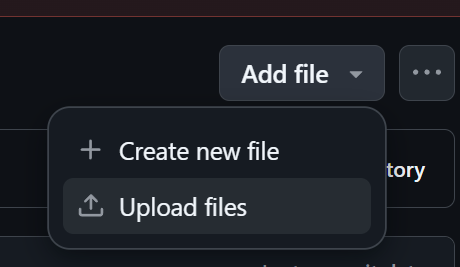
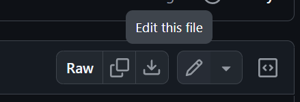

# 연구실 홈페이지 주소:
https://jinjae-kim.github.io/lab/


# 연구실 멤버 수정 방법
**Github는 reset을 하지 않는 이상 모든 수정사항이 추적됩니다! 겁먹지 말고 하나씩 따라하면 됩니다. 아래의 모든 과정은 별도의 프로그램 없이 웹에서 진행할 수 있습니다.**


전체적인 순서는 다음과 같습니다.
1. 프로필 사진 업로드(없을 시 `images/member_images/no-photo-person.png`를 그대로 사용)
2. 코드 블럭 복사 및 `tab_members.html`의 적당한 위치에 붙여넣기
3. 코드블럭의 프로필 사진 경로 수정
4. 코드블럭의 내용 수정


tab_members.html에 멤버목록이 나열되어있습니다.
PostDoc, PHD, MS로 분리되어 있으니 해당 섹션을 찾아갑니다.

다음 코드 블럭이 한 멤버에 해당합니다.
```html
<div style="margin-bottom: 10px; display: flex;">
    
    <div style="margin-left: 10px;">
        <h3>[Name]</h3>
        설명을 여기에<br>
        넣으면 됩니다.<br>
        "br" 태그는 줄바꿈을 의미합니다.<br>
    </div>
</div>
```

## 1. 프로필 사진 업로드(없을 시 `images/member_images/no-photo-person.png`를 그대로 사용)

웹 github에서 `images/member_images` 폴더를 찾아갑니다.




`images/member_images`폴더에 `[멤버사진파일이름].png`를 업로드 합니다.

(확장자가 jpg등인 경우는 코드에서도 .jpg로 지정하면 됩니다.)

## 2. 코드 블럭 복사 및 `tab_members.html`의 적당한 위치에 붙여넣기


멤버 하나분의 코드 블럭을 `tab_members.html`의 적절한 위치에 붙여넣기 한 뒤

## 3. 코드블럭의 프로필 사진 경로 수정
```html

```

에서 src 경로를 올바르게 지정합니다.

## 4. 코드블럭의 내용 수정
[Name]과 설명 등을 수정합니다.

## 5. 저장하고 5분정도 기다리면 웹에 반영됩니다!